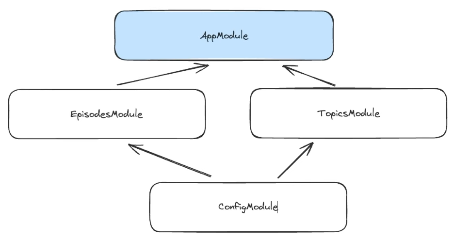

src = https://www.youtube.com/watch?v=2gtiffE3__U  
NestJS Crash Course from Tech Vision

# Intro

NestJS is a framework that makes it nearly impossible to write bad code.  
Nest achieves this by enforcing a **very rigid code architecture**.  

As a result, you can build an app that is: 
- scalable
- easy to test
- loosely coupled

In this video, we'll see:
- how to stucture our code
- 10 key concepts
- how to build a podcast API

# 1. The Nest CLI

This is Nest's secret weapon.  

The first thing the CLI can do for us is to create a Nest application:
- install the CLI globally by running `npm i -g @nestjs/cli` in your termial
- create a new project via `nest new my-podcast-api`
- place yourself in the project's folder via `cd my-podcast-api`
- start the dev server in watch mode via `npm run start:dev`
- the local dev environment runs at http://localhost:3000/

The CLI can do much more for us:
- create entire modules with CRUD resources
- create test files
- create controllers, providers, guards, pipes, etc.

# 2. The main.ts file

Located in the `src` folder.  
As we can see in this `main.ts` file, the `NestFactory()` function creates our Nest app using the `AppModule` class.  
And this is also where we specify which port the app listens to.  


# 3. The app.module.ts file

Also located in the `src` folder.  
We have an empty class here, and before that we are calling an `@Module()` function.  

That function is a **decorator**, a very important concept in NestJS.  

# 4. Decorators

Decorators are functions that can be applied to classes, methods, and method parameters.  
They add **extra functionality** to the class, method, or parameter they apply to.  

Some decorators have parameters so they can be configured to extract specific pieces of data 
or alter their behavior based on the argument provided.  

If we go back to the `app.module.ts` file, we can see that the `@Module()` decorator is applied to the `AppModule` class.  
That decorator takes a **configuration object** as an argument.  

**Note**: it's possible to create custom decorators, but we won't see that topic in this crash course.

# 5. Modules

A **strong** recommendation is to **structure** your code in modules.  
Each module will encapsulate a set of related capabilities.  

Every NestJS app has one **root** module, and only one.  
That root module can use other modules, which in turn can also use other modules...  

This network of interconnected modules creates what is called the **application graph**.  

## Modules in our app

In our app (my-podcast-api), `AppModule` is the **root** module.  
We know this because it's the class used to create the application in the `main.ts` file.  

Our Nest app will also have an `EpisodesModule`, a `TopicsModule`, and a `ConfigModule`.  

To create a Nest module from the CLI: `nest generate module episodes`  
This will generate an `episodes` folder and an `episodes.module.ts` file inside of it.  
Both of these will be created inside the `src` folder.  

Let's do the same to create the topics and config modules:  
`nest generate module topics`  
`nest generate module config`  

Each module has the `@Module()` decorator.  

If we open the `app.module.ts` file, we can see that all the modules we've generated with the CLI have been added 
to the `imports` property:
```ts
import { Module } from '@nestjs/common';
import { AppController } from './app.controller';
import { AppService } from './app.service';
import { EpisodesModule } from './episodes/episodes.module';
import { TopicsModule } from './topics/topics.module';
import { ConfigModule } from './config/config.module';

@Module({
  imports: [EpisodesModule, TopicsModule, ConfigModule],
  controllers: [AppController],
  providers: [AppService],
})
export class AppModule {}
```
This means that the `AppModule` class uses all those modules.  
The `imports` property is what defines how modules are organized.  

We can remove the ConfigModule from the AppModule, to then import it in the EpisodesModule.  
We can also import ConfigModule in the TopicsModule.  

We now have the following application graph:  


# 6. Controllers

If our app has no controller, then it cannot handle any incoming requests.  
Controllers are the **entry point** for most NestJS apps.  

A controller is simply a **class** that is decorated with the `@Controller()` decorator.  
If we open the `app.controller.ts` file, we can see that decorator.  

To create a controller inside the Episodes module, we can run this cmd:  
`nest generate controller episodes`  

And we can see that the generated controller takes a string as a parameter.  
That string is the `route path` managed by the controller.  

**But how do we know that the EpisodesController is part of the EpisodesModule?**  
If we look at the episodes.module file, we can see that the CLI has added the new controller.  

## Method decorators

The controller classes have **methods** to handle requests = request **handlers**.  

For example, we can add a findAll() method to the EpisodesController.  
For now, it just returns a string, but we will change that later.  
To indicate that it handles the GET requests, we use the `@Get()` decorator.  

It's the same principle for handling POST requests, or any other HTTP method.  

Method decorators can also take a string as parameter, and that string can be a nested route path.  
Let's say that we want a handler to return featured episodes, and we want that handler to be called 
for the route "episodes/featured".  
Check the code below to see how this can be done: 
```ts
import { Controller, Get, Post } from '@nestjs/common';

@Controller('episodes')
export class EpisodesController {
  @Get()
  findAll() {
    return 'all episodes'
  }

  @Get('featured')
  findFeatured() {
    return 'featured episodes'
  }

  @Post()
  create() {
    return 'new episode'
  }
}
```

So far, we've used class decorators, and method decorators, but there's another type of decorators that 
we haven't used yet.  

Some handlers will need access to the URL parameters, queries, the request body, or even the entire request object.  
For example, we can add a `sort` parameter to the findAll() method, and prefix it with the `@Query` decorator.  
We can do the same thing by prefixing other methods with `@Body` or `@Param`:
```ts
import { Controller, Get, Post, Query, Body, Param } from '@nestjs/common';

@Controller('episodes')
export class EpisodesController {
  @Get()
  findAll(@Query('sort') sort: 'asc' | 'desc' = 'desc') {
    console.log(sort)  // this is just to make use of sort
    return 'all episodes'
  }

  @Get('featured')
  findFeatured() {
    return 'featured episodes'
  }

  @Get(':id')
  findOne(@Param() id: string) {
    console.log(id)  // this is just to make use of id
    return 'one episode'
  }

  @Post()
  create(@Body() input: any) {
    console.log(input)  // this is just to make use of input
    return 'new episode'
  }
}
```
**Note**: in the handler that gets an episode by id, we use the `:id` syntax because we want it to be a URL parameter.  

## Testing the controllers

With this simple implementation of the controllers, we can send requests to the route we've defined, 
or we can also open up a web browser and navigate to these routes: 
- http://localhost:3000/ will return/display a simple "Hello World!"
- http://localhost:3000/episodes will return/display "all episodes"
- http://localhost:3000/episodes/featured will return/display "featured episodes"
- http://localhost:3000/episodes/id will return/display "one episode"

Our handlers are doing a great job at receiving incoming requests and returning a response to the client.  
But there is a big piece missing...  

Instead of returning mock responses, our handlers need to delegate the real work of finding and creating
episodes to a **service**.

# 7. Providers

Services are part of a bigger NestJS family: the **Providers**.  
Nearly everything in Nest is a provider.  

Providers are **classes** that have the `@Injectable` decorator.  
This means that they can be injected in other classes.  

## Service creation

Let's create the episodes service via the CLI: `nest generate service episodes`.  
On top of creating the `episodes.service.ts` file and the test file, the CLI will automatically add
the new service to the providers list in the module (`episodes.module.ts`):
```ts
import { Module } from '@nestjs/common';
import { EpisodesController } from './episodes.controller';
import { ConfigModule } from 'src/config/config.module';
import { EpisodesService } from './episodes.service';

@Module({
  imports: [ConfigModule],
  controllers: [EpisodesController],
  providers: [EpisodesService]
})
export class EpisodesModule {}
```

### Very important note

The above part is **crucial** if we create our providers manually, because we need to 
**make sure to add them** to the **providers** list, otherwise they can't be injected in other classes.  

## Implementing the EpisodesService class

We need a few basic **methods** to manage the episodes data.  
These methods' implementation can be seen in the `episodes.service.ts` file.  

All these methods have been declared as **asynchronous** even if there's nothing asynchronous 
going on yet (no `await` keyword), since we use an **in-memory** array for this demo.
In a real app, we would most likely store and retrieve the data **asynchronously** from a database.  

Note that the `Episode` type is defined in a dedicated file = `episodes.dto.ts`.  
And so is `CreateEpisodeDto`, which is an episode with no id.  
It's best practice to define data structures in a **Data Transfer Object** (DTO) file.

# 8. Dependency Injection

**What's the point of having a service if it's not used anywhere?**  
Now is time to talk about another pillar of NestJS: **Dependency Injection**.  

Let's recap what we have built so far:
- a root module = app.module.ts, which imports EpisodesModule and TopicsModule
- both EpisodesModule and TopicsModule import the ConfigModule
- inside EpisodesModule, we have EpisodesController and EpisodesService 

## Injecting EpisodesService in EpisodesController

The **controller** needs to use the **service** class, but in Nest we don't create an instance 
of the service inside the controller. Instead, the service class will be **injected** in the 
controller by NestJS at **runtime**.  

One way to tell Nest to inject the service in the controller is to add a constructor to 
the controller class.  

**That's how Dependency Injection works in NestJS:**
- you create the provider class (service) with the `@Injectable` decorator
- you make sure to declare the provider in the module
- and you inject this provider in the controller class constructor
- After that, the framework (Nest) takes care of wiring things up at runtime

Now, instead of returning strings, the handlers (inside `episodes.controller`) can call 
the injected service methods:
```ts
@Get()
findAll(@Query('sort') sort: 'asc' | 'desc' = 'desc') {
  return this.episodesService.findAll(sort)
}

@Get('featured')
findFeatured() {
  return this.episodesService.findFeatured()
}

@Get(':id')
findOne(@Param() id: string) {
  return this.episodesService.findOne(id)
}

@Post()
create(@Body() input: CreateEpisodeDto) {
  return this.episodesService.create(input)
}
```
For the `create()` method, we have replaced the ugly `any` with `CreateEpisodeDto`.  

## What if we want to inject a service from one module to another?

We can quickly create a config service using the **CLI**: `nest generate service config`.  
We can also use **shortcuts** with the CLI: `nest g s config` is equivalent to the previous cmd.  

As usual, the CLI will automatically add the new service to the **providers** list in `config.module`.  

Now, we need to add the config service to the **exports** list.  
```ts
@Module({
  providers: [ConfigService],
  exports: [ConfigService]
})
export class ConfigModule {}
```

We then need to make sure that EpisodesModule imports ConfigModule:
```ts
@Module({
  imports: [ConfigModule],
  controllers: [EpisodesController],
  providers: [EpisodesService]
})
export class EpisodesModule {}
```